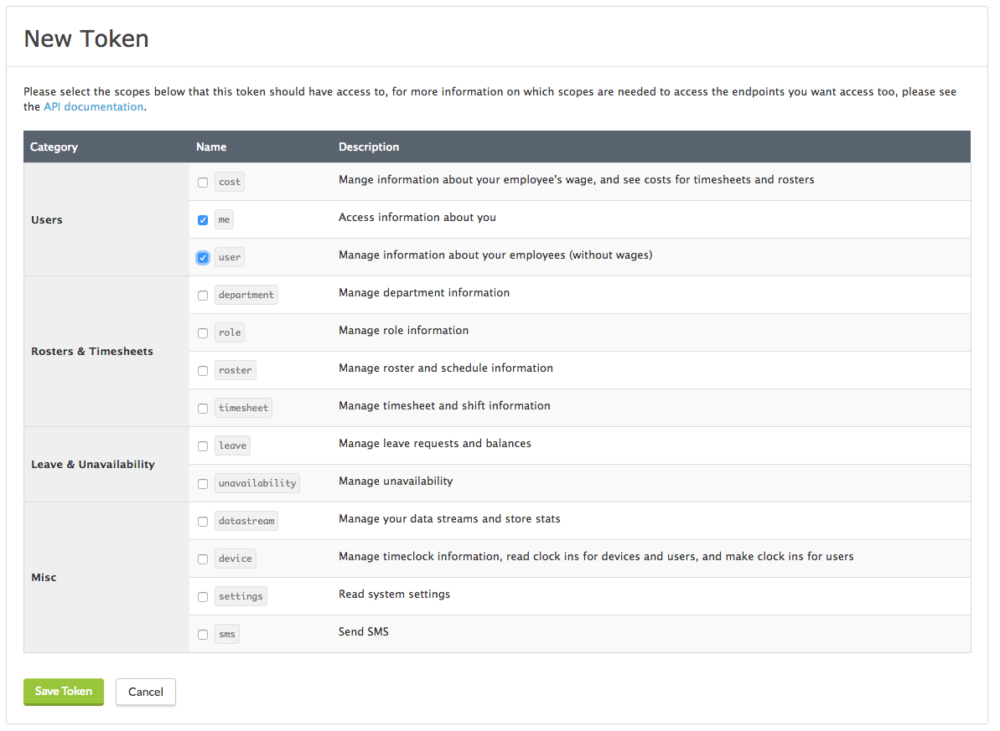
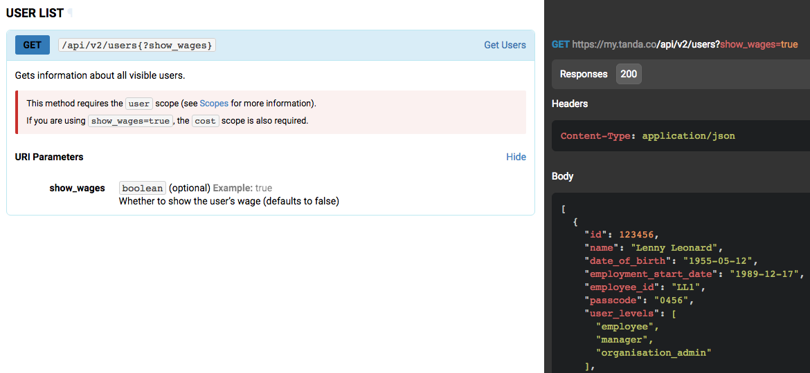
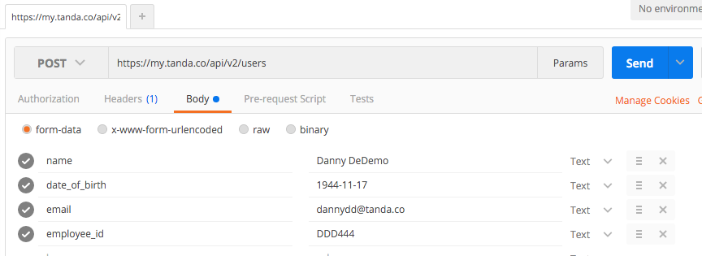
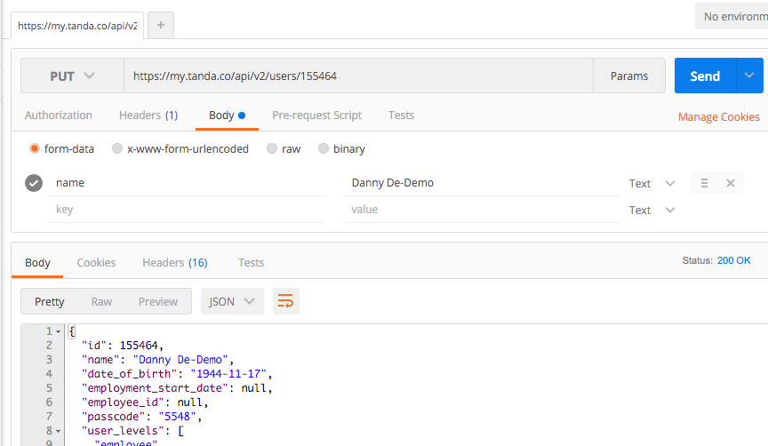

This guide steps you through the basics of getting up and running with the Tanda API. We'll cover how to connect to your account, how to get some data out, and how to put some data in. The API does a **lot** and we encourage you to [read the docs](https://my.tanda.co/api/v2/documentation) for a complete list of functionality - this is just a quick intro to some basic concepts.

To test the API, we highly recommend [Postman](https://www.getpostman.com/), a tool for working with APIs. There will be some example Postman screenshots in this guide. The API documentation includes sample [curl](https://curl.haxx.se/) statements, and there's code samples in various other languages [on GitHub](https://github.com/TandaHQ/api-v2-code-samples). But the cool thing about Postman is that **there's no programming knowledge required for this guide**.

-----------------

**0. Glossary**

A few terms you'll see in this guide, that you might have seen before:

- *Request* - in [HTTP](https://en.wikipedia.org/wiki/Hypertext_Transfer_Protocol#Request_methods), a message sent from one system to another (in this case, from your code, to the API)
- *Resopnse* - what a web server sends back when you send it a request
- *Endpoint* - a particular URL that the API responds to
- *GET*, *POST*, *PUT*, *DELETE* - [HTTP](https://en.wikipedia.org/wiki/Hypertext_Transfer_Protocol#Request_methods) methods. GET means "give me data". POST means "insert this data". PUT means "update with this data". DELETE means "get rid of data".

-----------------

**1. Getting authenticated**

The first step to working with the API is to get an **access token**. An access token is a random series of letters and numbers used to uniquely identify you. You need to provide it with every request you make to the API.

To get an access token, go to https://my.tanda.co/api/oauth/access_tokens/new (you'll need to be logged in to Tanda). You'll need to choose which [scopes](https://my.tanda.co/api/v2/documentation#header-scopes) you want to access. Scopes let you control which parts of the API you can access. For this example we are just going to look at User data so we just need the `me` and `user` scopes - but if you are just playing around with the API there's no real harm in ticking all scopes.

Once you click save token, you will see your newly created access token. You must copy and paste this access token somewhere safe, because you'll only be able to see it once. This access token is valid forever - if you want to disable it, you can always delete it later by coming back to https://my.tanda.co/api/oauth/access_tokens and clicking delete token.

To use this access token, you'll have to set a custom header on each request. In Postman, this looks like this:

-----------------

**2. Getting data**

Now that you have an access token, you can use it to query the API. Let's start by getting a list of staff.

In the API documentation, we find the appropriate endpoint - [Users](https://my.tanda.co/api/v2/documentation#users). It says we need to make a `GET` to `/api/v2/users`. That's easy in Postman:

The response will be [JSON](https://en.wikipedia.org/wiki/JSON) formatted, which is handy because it's easy for humans to read, but also can easily be parsed by most programming languages. For every endpoint in the API, the documentation includes an example JSON response in the right sidebar.

-----------------

**3. Posting (creating) data**

Let's try adding in a new employee. To do this, we want the "Create User" endpoint in the API documentation. This endpoint says we should make a `POST` to `/api/v2/users`. Let's do that in Postman. According to the API documentation, only the `name` field is required - but we're going to enter a few other fields too, just to play with different data types.

Send this request, and the API will return a complete employee record (or an error, if the employee could not be created):

You'll also be able to see the newly created employee inside Tanda - in this case, by going to https://my.tanda.co/users. Unless it says so in the documentation, all API methods make changes to Tanda instantly, so you can always check that your API call has worked by checking on the Tanda site.

-----------------

**4. Putting (editing) data**

Let's say we got that employee's name wrong. We can easily change that using the API. The API method to edit things is PUT ([doc](https://my.tanda.co/api/v2/documentation#users-user-put)), and when you're editing things, you need to include the ID of the object you'd like to edit.

When we created Danny's profile in Tanda in the posting section just above, the JSON response we got back included his ID. But if we don't have that handy, we can also find his ID by GETting a list of users and finding him in the list that's returned. In this example, his ID is 155464. So, if we want to edit Danny's details, we would make a `PUT` to `/api/v2/users/155464`. When PUTing, we only need to include the fields we want to change:

As you can see, IDs are pretty important - by knowing Danny's ID we were able to make other changes to his record. In Tanda, everything has an ID, and you'll use this ID to make changes or delete things. Often, the API code you're writing will be keeping data in sync between another system you use and Tanda. It will make your API life much easier if you keep a mapping of IDs between the two systems somewhere. So for example, if you have another system with staff data that you are going to import into Tanda, then you should keep a mapping between unique IDs in that system, and the corresponding user IDs in Tanda.